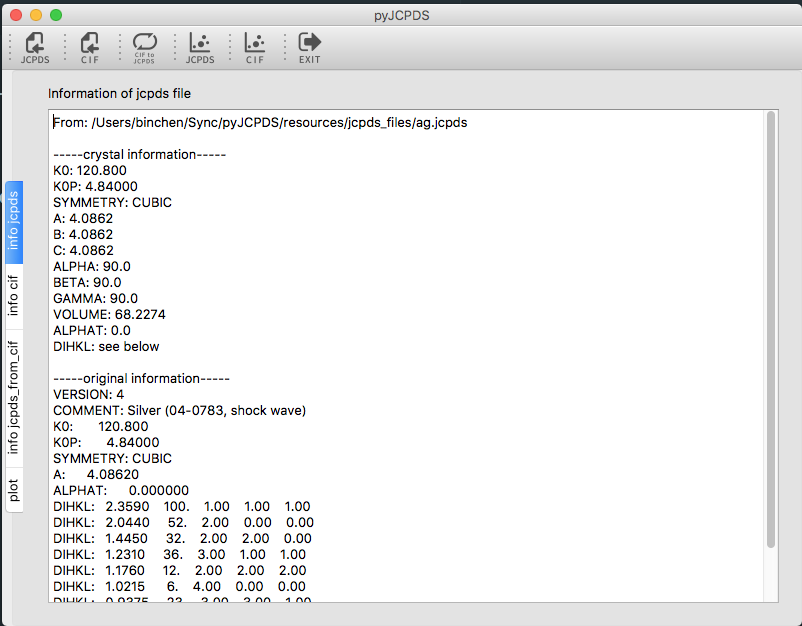
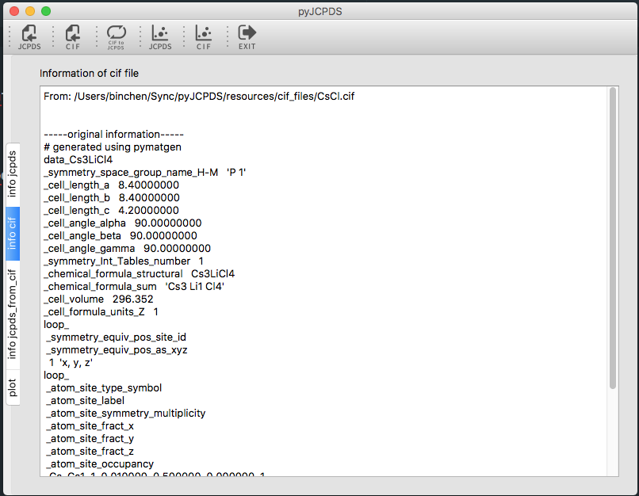
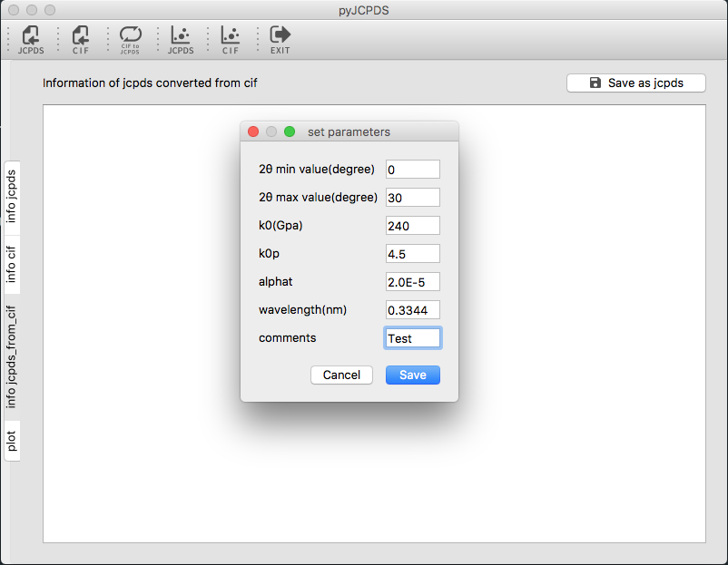
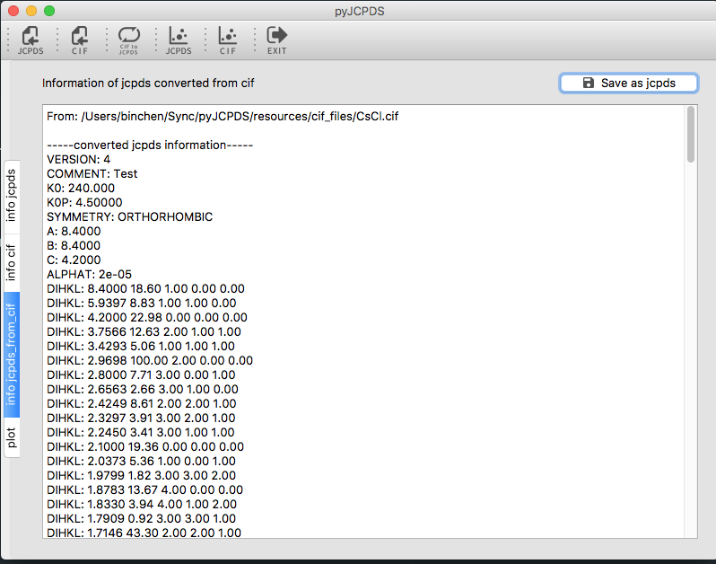
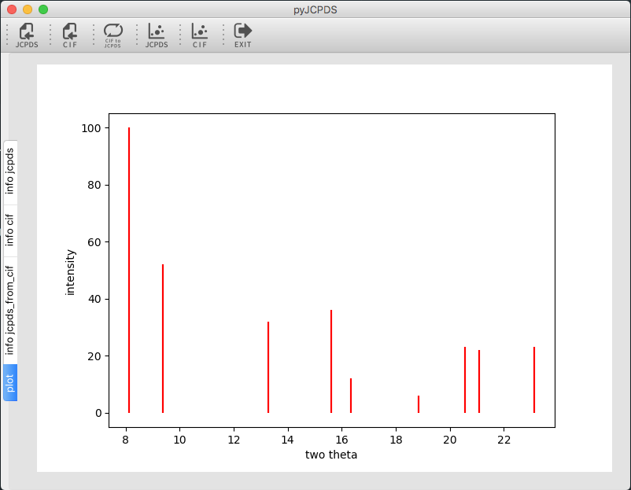

# Open-source-tools-for-maintaining-and-visualizing-mineral-physics-database
pyJCPDS, an integration of open source tools written in python for handling  and visualizing JCPDS(Joint Committee on Powder Diffraction Standards) files of planetary materials in mineral physics, including displaying crystal information from a JCPDS file, converting a CIF(Crystallographic Information Framework) file to a JCPDS file and plotting interactive XRD patterns from JCPDS or CIF files(and optionally comparing patterns from JCPDS and CIF of the same material). Besides the visualized GUI tools, the final goal also includes extension of the python codebase for the rudimentary JCPDS database (http://comptech.compres.us/tools/jcpds/) to create a web-based and interactive mineral physics database specific to planetary materials.

Our project webpage: https://github.com/willsunustc/pyJCPDS

Note:Still under development.

## Required packages
`numpy` `pandas` `matplotlib` `pymatgen` `PyQt5`

## References
ds_jcpds(modules used): S.-H. Shim (2017) PeakPo - A python software for X-ray diffraction analysis at high pressure and high temperature. Zenodo. http://doi.org/10.5281/zenodo.810199
